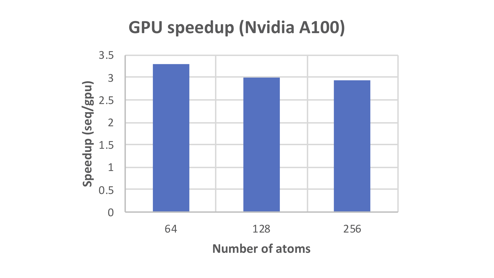
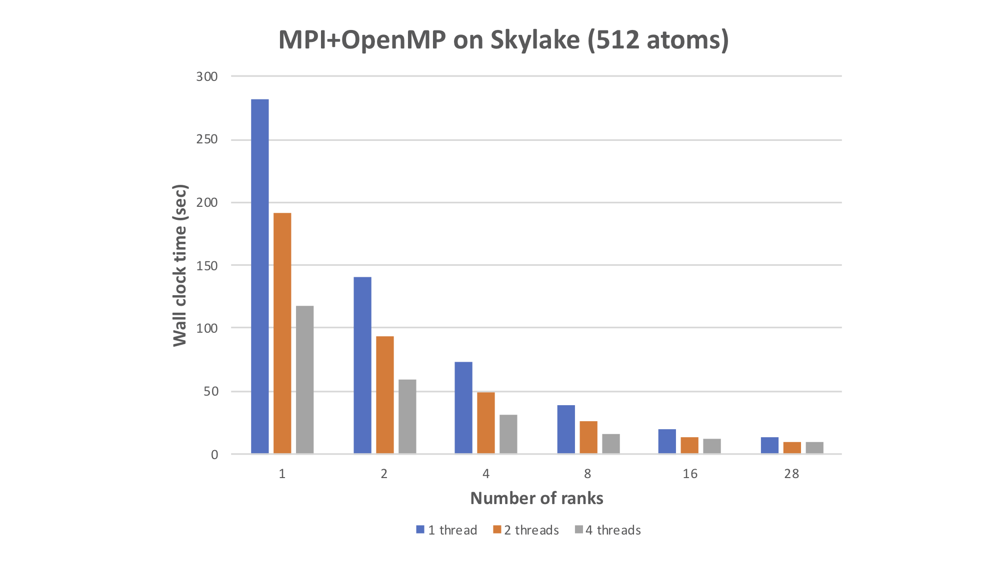

# Basic Hartree-Fock Proxy Application 

### Background 

Hartree-Fock is considered the entry-level method of quantum chemistry. 
Its computational characteristics are similar to those of Density Functional Theory. 
As with many quantum chemistry methods, the implementation typically depends on a choice for the integral computation method. 
However, there are many integral methods available, each method has unique performance characteristics, and the integral codes themselves tend to be very large. 

On the other hand, proxy applications aim to capture a given theory method without the clutter of a major package to enable a rapid assessment of its performance characteristics on new and emerging hardware. 
To this end, the present proxy application uses a simplified integral code to allow the major compute load and data-movement of Hartree-Fock to be studied in different run modes spanning sequential and parallel execution, including GPU offloading. 

### Algorithm

The kernel of Hartree-Fock for a given molecular system computes the electron-repulsion term of the Fock operator. 
Electron repulsion integrals over gaussian-type functions located on different atomic centers (four per integral) are computed and contracted with elements of the (square) density matrix before being summed to elements of the (square) Fock matrix. 
The cost increases as the fourth power of the problem size. 
However, the magnitude of an integral declines with distance between the centers and screening (based on the Schwarz Inequality) can be used to avoid small terms. 
Within the integral calculations the gaussian-product factors are also tested to avoid small terms. 
While the number of atoms is the primary cost factor, the atomic positions also influence the compute load through integral screening.

### Model

The compute load is simulated using a cluster of helium-like atoms.
Each atom hosts a single function - or 'orbital' - occupied by a pair of opposite-spin electrons.
Each orbital is contracted over a set of s-type gaussian functions. 
The compute load can be varied through the number and positioning of the atoms, together with the orbital contraction length, as described in more detail below. 
As mentioned above, the compute load increases as N4, where N is the number of helium-like atoms. 
Screening typically reduces the cost to O(N3). 
The individual integral cost is, likewise, fourth-order in the orbital expansion length(s) but very long expansions (>>30) are not typical of routine calculations.
Memory requirements and data-movement scale as O(N2). 

### Variables

In order to simulate different compute loads, the following are variable- 
* The number of helium-like atoms (input, called 'natom' in the code).
Determines the memory requirements (order of the Fock and Density matrices), the data-movement and the primary compute loads. 
* The contraction length of atomic orbital (input, 'ngauss' in the code). 
Determines the per-atom compute load. 
* The (input) gaussian exponents and contraction coefficients. 
This amounts to a specification of the 'basis set' for the atoms. 
The values can affect cost via the internal integral screening with large exponents on different centers and/or small coefficients causing more integral terms to be skipped. 
The contraction coefficients are normalized internally allowing arbitrary values to be input. 
* Molecular geometry (input). 
The cartesian coordinates of each atom are input in conventional angstrom units. 
The relative positioning of atoms varies the compute load via integral screening with closer spacing giving higher complexity. 
* The screening cutoff ('dtol', can be varied by editing the code). 
The cutoff affects both the compute load and the energy with coarser screening (larger value) causing more terms to be skipped giving a lower overall cost but a less accurate energy, and vice versa. 
For these reasons routine Hartree-Fock applications seldom vary the cutoff. 

### Current Test Set Input Choices

Helium atoms are arranged on a regular 3D grid.
In most of the inputs the He...He distance is fixed at 1.4 Angstroms (A) which approximates the C-C bond length and yields a cost-complexity of O(N2.6), typical of many Hartree-Fock codes. 
Other inputs use a separation of 1.0A which is closer to the length of a bond-to-hydrogen (OH,CH,NH...) and yields a complexity of O(N2.9). 

### Software Overview 

Software language: Fortran (90+)

The essential algorithm is relatively small (about 200 lines, with comments) making it convenient to capture each run mode currently offered in a separate code.
The individual codes are easier to understand (much preprocessing clutter can be avoided) and permit each run mode to be studied and modified independently. 

| Proxy App Version          | Description  | 
|  :-:        |     :-:                |
| basic-hf-proxy-seq.f90     | Plain sequential version  | 
| basic-hf-proxy-mpi.f90     | MPI parallel version  | 
| basic-hf-proxy-omp.f90     | Multi-threaded parallel, using OpenMP  | 
| basic-hf-proxy-gpu.f90     | Single GPU offload, using OMP5.0  | 
| basic-hf-proxy-mpi+omp.f90 | Combining MPI for outer loops, OMP for inner loops  | 
| basic-hf-proxy-mpi+gpu.f90 | MPI, with GPU offload for inner loops  | 

## Build instructions

| Code                       | Dependencies  | 
|  :-:        |     :-:                |
| basic-hf-proxy-seq.f90     | Fortran 90+ compiler  | 
| basic-hf-proxy-mpi.f90     | Fortran 90+ compiler, MPI library  | 
| basic-hf-proxy-omp.f90     | Fortran 90+ compiler supporting OpenMP  | 
| basic-hf-proxy-gpu.f90     | Fortran 90+ compiler supporting OpenMP 5.0 or higher  | 
| basic-hf-proxy-mpi+omp.f90 | Fortran 90+ compiler supporting OpenMP, MPI library  | 
| basic-hf-proxy-mpi+gpu.f90 | Fortran 90+ compiler supporting OpenMP 5.0 or higher, MPI library  | 
 
Note that the 'mpi+gpu' version has not been tested yet (TBD).  

In the root dir, 

$ mkdir bin 

$ make 

### Specific build examples 
 
Sequential version, with GNU fortran compiler
 
$ gfortran basic-hf-proxy-seq.f90

MPI parallel version, with compiler-wrapper

$ mpifort basic-hf-proxy-mpi.f90

MPI parallel version, with MPI library

$ gfortran basic-hf-proxy-mpi.f90 -L[path to MPI lib] -I[path to mpif.h] 

OpenMP parallel version

$ gfortran -fopenmp basic-hf-proxy-omp.f90

For GPU offload, eg. with pgf90 (supporting OMP5.0+) 

$ pgf90 -mp=gpu -Mcuda=cc80,cuda11.2 basic-hf-proxy-gpu.f90

See also the Nsight Compute profile, ./docs/ncu.profile.bhfp-gpu.he64 

## Run Examples (see ./tests) 

Sequential version

$ ./a.out < he4

MPI version

$ mpirun -n 2 ./a.out < he4

OMP version

$ export OMP_NUM_THREADS=2

$ ./a.out < he8

#### Small regression tests  (see ./tests) 
|no. He atoms | 2-el. E/AU to 6 places |
|  :-:        |     :-:                |
|   4 |    4.050176 | 
|   8 |   11.585213 | 
|  16 |   36.902417 | 
|  32 |  122.248336 | 

#### Large regression tests  

|no. He atoms | 2-el. E/AU    | 
|  :-:        |     :-:                |
|  64 |  419.672121   | 
| 128 | 1300.093626   | 
| 256 | 4204.804478   | 
| 512 |14131.752017   | 

Agreement to 6 places across different hardware, compilers, etc, is typical.

## Figure-of-Merit (FOM)

Sample performance data with various hardware and execution modes (default optimization levels). 
Please note that the proxy codes have NOT been hand-optimized for any particular platform/hardware/vendor at this time. 

#### GPU Speedup on Nvidia A100 

 

See also the Nsight Compute profile, ./docs/ncu.profile.bhfp-gpu.he64 

#### MPI with OpenMP multi-threading (on Skylake node) 

 

#### MPI parallelism on KNL cluster (ALCF "Theta" platform) 

 

###  Memory Footprint 

Memory Required = 2Ngauss + 3Natom + 3.5Natom2

Examples 

| Ngauss | Natom |  Memory/DP words = Mb | 
|  :-:   |  :-:  |  :-:    |  
|   3    |  128  |   57734  =  0.46 Mb | 
|   3    |  256  |  230150  =  1.84 Mb | 
|   3    |  512  |  919046  =  7.35 Mb | 
|  30    | 1024  | 3673148  = 29.39 Mb | 

### How to Validate
#### Example using GAMESS

* 1. See comments in the proxy app code about reading a density matrix from a file. Rebuild the proxy executable as appropriate.

* 2. Convert the desired input to a GAMESS '.inp' file (see examples, ./tests/he4.inp, he8.inp). Be sure to include  NPRINT=5  so that GAMESS prints the density matrix

* 3. Run GAMESS.

* 4. Extract the final density matrix from the GAMESS output and convert it to a simple triangular format, appending it to the input file for the proxy app.

* 5. Run the new proxy executable with the new input, and compare output to the line matching-
  'ELECTRON-ELECTRON POTENTIAL ENERGY' in the GAMESS output.

